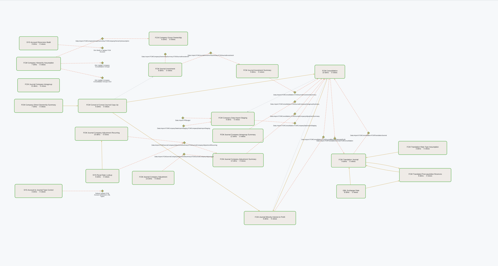

# TM1 CubeMap

**Interactive data lineage and cube visualisation for IBM Planning Analytics / TM1**

TM1 CubeMap turns your TM1 model into a navigable graph — every cube, TI process, and Python ETL script becomes a node; every rule reference, data write, and script dependency becomes a directed edge. No more reading rules files to understand data flow.



---

## What it does

| Feature | Description |
|---|---|
| **Graph visualisation** | All cubes, TI processes, and Python ETL scripts as a navigable diagram — pan, zoom, drag to rearrange |
| **Calculation Trace** | Select a measure on any cube and trace exactly where the value comes from, step by step |
| **Rule inspection** | Full rules text, line/DB() ref counts, upstream and downstream connections in one panel |
| **TI code viewer** | All four TI sections (Prolog, Metadata, Data, Epilog) on a single click |
| **Tags** | Annotate cubes and processes with custom labels for filtering and grouping |
| **Layouts** | Save and restore named node position layouts |
| **AI documentation** | Generate AI-ready prompts for individual objects or entire tagged modules |
| **Multi-server** | Switch between TM1 instances and databases without restarting |

---

## Who uses it

| Role | How they use it |
|---|---|
| **TM1 Developer** | Understand data flow at a glance, trace calculation chains, read rules and TI code |
| **Solution Architect** | Map cube dependencies before refactoring or migrating a model |
| **Finance Analyst** | Trace where a balance or metric originates — without reading raw TM1 syntax |
| **IT / Data Governance** | Document the model, tag objects by business area, export AI specs for migration |

---

## How to get it

**Docker (recommended):**

```bash
mkdir tm1-cubemap && cd tm1-cubemap
curl -sSLO https://raw.githubusercontent.com/falconbi/tm1_cubemap/main/docker-compose.yml
docker compose up -d
```

Open **http://localhost:8084** — a setup form appears on first run. Fill in your TM1 server details and click **Refresh** to extract the model.

**Python:**

```bash
python3 -m venv venv && source venv/bin/activate
pip install -r requirements.txt
python3 app.py
```

---

## Requirements

- TM1 V11 on-prem or V12 on-prem
- TM1 REST API enabled
- Docker (recommended) or Python 3.10+

---

> **Phase 1 — Early Release.** CubeMap is in active development. Core features are working. Feedback and bug reports welcome via [GitHub Issues](https://github.com/falconbi/tm1_cubemap/issues).
