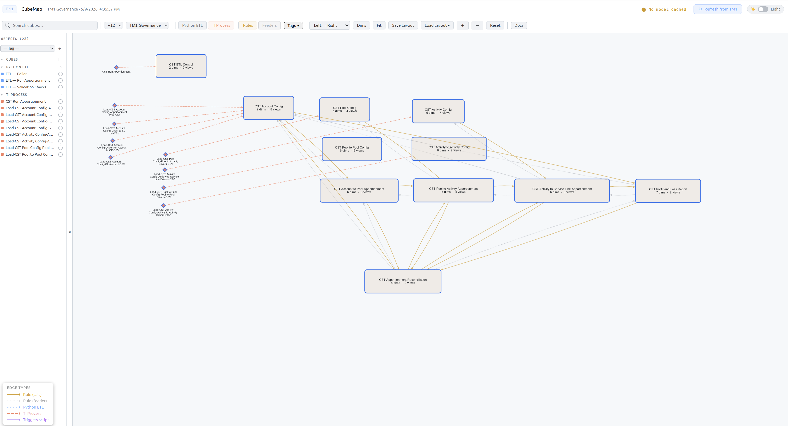
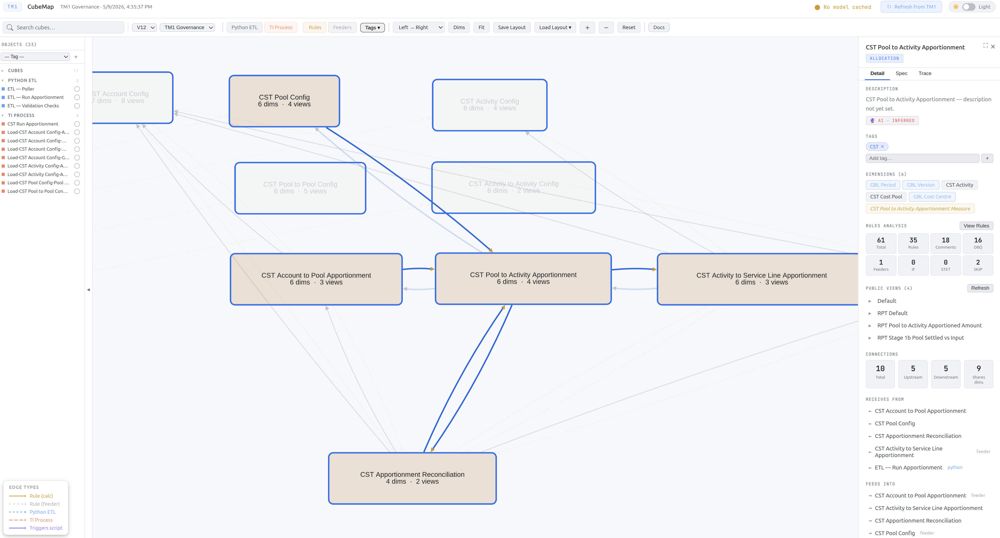
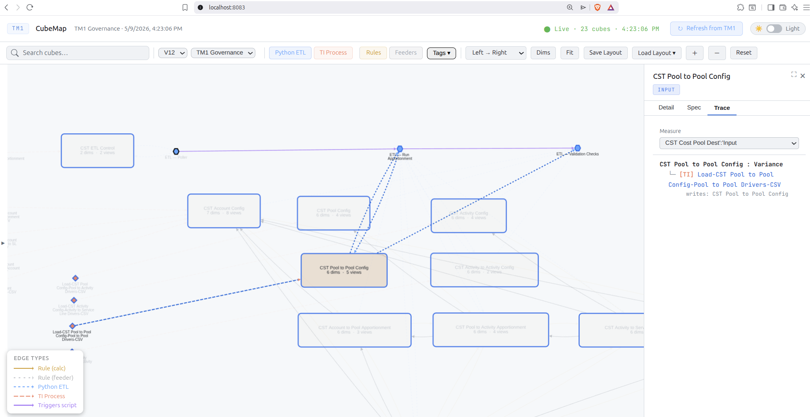

# TM1 CubeMap — User Guide

## What is CubeMap?

CubeMap turns your TM1 model into an interactive graph. Every cube, TI process, and Python ETL script is a node; every rule reference, TI read/write, and script trigger is an edge. Click any node to inspect dimensions, rules, script code, and data lineage.

---

## Quick Start

### 1. Prerequisites

- TM1 V11 on-prem server (V12 also supported)
- REST API enabled on the TM1 server
- Docker OR Python 3.10+

### 2. Start CubeMap

**Docker (recommended):**
```bash
mkdir tm1-cubemap && cd tm1-cubemap
curl -sSLO https://raw.githubusercontent.com/falconbi/tm1_cubemap/main/docker-compose.yml
docker compose up -d
```

**Python (manual install):**
```bash
python3 -m venv venv && source venv/bin/activate
pip install -r requirements.txt
mkdir config && cp servers.json.example config/servers.json  # fill in your TM1 details
cp .env.example .env
python3 app.py
```

### 3. Connect to your TM1 server

**Docker:** Open **http://localhost:8084** — a setup form appears on first run. Enter your TM1 server details and click Save. No files to edit manually.

**Python:** Edit `config/servers.json` with your TM1 instance details before starting. See [Configuration](#configuration) for field descriptions.

### 4. Extract your model

Click **Refresh** in the toolbar. This extracts cubes, rules, TI processes, dimensions, and edges from your TM1 server. Extraction runs in the background — the page reloads automatically when complete.

<p align="center"></p>

---

## Configuration

### servers.json

Each entry in the JSON array is a TM1 server with one or more databases.

| Field | Required | Description |
|---|---|---|
| `name` | yes | Display name shown in the instance dropdown |
| `address` | yes | TM1 server IP or hostname |
| `auth` | yes | `"v11"` (Basic auth) or `"v12"` (OAuth2) |
| `user` | yes | Admin username |
| `password` | V11 only | Admin password |
| `client_id` / `client_secret` | V12 only | From your TM1 OAuth2 client |
| `databases` | yes | Array of databases on this server |
| `databases[].name` | yes | TM1 database name |
| `databases[].port` | yes | TM1 REST API port |

**V11 example:**
```json
{
  "name": "Production",
  "address": "192.168.1.100",
  "auth": "v11",
  "user": "admin",
  "password": "apple",
  "databases": [
    {"name": "Finance", "port": 8000},
    {"name": "Budget",  "port": 8001}
  ]
}
```

**Multiple servers:** Add multiple entries to switch between instances from the toolbar dropdown. Extraction and tags are per-server.

### .env

| Variable | Default | Description |
|---|---|---|
| `PORT` | `8084` | Flask server port |

---

## Interface Guide

### Graph view (centre)

The main graph shows cubes, TI processes, and Python scripts as nodes with directed edges showing data flow.

**Node shapes:**
- Rounded rectangle — Cube
- Diamond — TI Process
- Hexagon — Python ETL

**Edge styles:**
- Gold solid — Rule calculation (DB() reference)
- Orange dashed — TI Process read/write
- Blue dashed — Python ETL data flow
- Gray dotted — Rule feeder
- Purple solid — Script trigger

**Navigation:**
- Click any node to open the detail panel
- Drag to pan
- Scroll to zoom
- Click and drag nodes to rearrange

### Toolbar (top)

| Button | Description |
|---|---|
| **Refresh** | Re-extract model from the active TM1 server |
| **RAM** | Toggle heatmap overlay — node brightness = RAM usage (V11 only, requires Performance Monitor enabled on the TM1 server) |
| **Filters** | Toggle visibility by node type (Input, Driver, Rollup, Report, Reconciliation, Python, TI, Rules) |
| **Layout** | Switch between Dagre (hierarchical), Concentric, or Circle layouts |
| Server dropdown | Switch between configured TM1 instances/databases |

### Sidebar (left)

Lists all objects grouped by type. Each group shows a count. Click any object to navigate to it on the graph. The sidebar also has a tag filter dropdown to filter by tag.

### Detail panel (right)

Opens when you click a node. Has three tabs:

<p align="center"></p>

**Detail tab:**
- Object name and type badge
- Description (can be edited, with source badges: Manual, AI Rules, AI Inferred)
- Tags — add, remove, or create new tags
- Dimensions list
- Rules analysis — metrics (lines, DB() refs, IFs, feeders, etc.) with a View Rules button to see the full rules text
- Views
- Connections — upstream (receives from) and downstream (feeds into) with edge-type badges
- Click any connected object to navigate to it

**Spec tab:**
- AI-generated or manually written descriptions for the selected object
- Prompt button generates an AI prompt from the object's rules and context

**Trace tab:**
- See [Calculation Trace](#calculation-trace) section below

### Panel expand

Click the expand button (⛶) next to the close button to widen the detail panel for easier reading of long content.

---

## Calculation Trace

The Trace tab shows where a value comes from — the full data lineage chain for a selected measure.

**How it works:**

1. Select a cube with rules and click **Trace**
2. Pick a measure from the dropdown
3. CubeMap traces three legs automatically:

**Rules leg:** Walks `DB('SourceCube', ...)` references in rules text to find which cubes contribute to the measure.

**TI leg:** At each cube in the chain, finds TI processes that write to it. Traces what each TI reads from and continues through those cubes.

**ExecuteProcess leg:** For each TI, scans its code for `ExecuteProcess('OtherTI', ...)` calls. Traces what those called TIs read and write, and recurses through their own ExecuteProcess calls.

**Example output:**
```
FCM Consolidation › Net Income
  ├── [Rules] DB('FCM Journal Investment Summary', ..., 'Net Income')
  │     └── [Rules] DB('FCM Journal Investment', ..., 'Amount')
  │           └── [TI] Data.Import.FCMJournalInvestmentSummary
  │                 ├── [Rules] FCM Transaction Source : Amount
  │                 └── [Exec] Bedrock.Cube.ViewAndSubsets.Create
  │                 reads:  FCM Journal Investment
  │                 writes: FCM Journal Investment Summary
  └── [TI]   Data.Import.FCMConsolidation.FCMTranslationJournal
              └── [Rules] FCM Translation Journal : Net Income
              reads:  FCM Translation Journal
              writes: FCM Consolidation
```

<p align="center"></p>

**Infrastructure calls:** Utility processes with no cube writes (e.g. dimension management, security, subset creation) are collapsed under a **▶ Infrastructure calls** section. Click to expand.

**Click to navigate:** Any node name in the trace tree is clickable — it navigates the graph to that object.

**Guards:** Max 5 hops depth. Cycle detection via visited set prevents infinite loops.

---

## Tags

Tags let you annotate cubes with custom labels for filtering and organisation.

**Creating tags:**
- In any cube's detail panel, type a tag name in the tag input and press Enter or click +
- New tags auto-assign a colour

**Filtering by tag:**
- Use the tag filter dropdown in the sidebar to show only cubes with specific tags

**Persistence:**
- Tags are stored in the model file and survive re-extraction (Refresh)
- Tags are per-server — switching servers clears tag state

---

## Layouts

Node positions are saved per layout. The **default** layout is auto-loaded.

**Saving:** After rearranging nodes, the layout auto-saves to the server.

**Restoring:** Layout positions are restored on page load and after Refresh.

---

## AI Documentation

CubeMap has two AI-assisted documentation features — one for individual objects, one for entire modules (groups of tagged objects).

---

### Object Spec (Spec tab)

The Spec tab on any detail panel generates a functional specification for a single cube, TI process, or Python script.

**Generating a spec:**
1. Click any node to open its detail panel
2. Click the **Spec** tab
3. Click **Prompt** — CubeMap assembles a prompt containing the object's rules or code, upstream/downstream connections, and instructions
4. Copy the prompt and paste it into your preferred AI tool (Claude, ChatGPT, etc.)
5. Paste the AI response back into the Spec editor and click **Save**

**What the prompt includes:**
- Object name, type, and connections (what feeds it, what it feeds)
- For cubes: full rules text
- For TI processes: all four code sections (Prolog, Metadata, Data, Epilog)
- For Python scripts: full script source
- Instructions asking the AI to produce a structured spec with purpose, inputs, logic (in plain maths/pseudocode — no TM1 syntax), outputs, dependencies, and migration notes

**Output format:** The AI returns a JSON spec with these fields: `purpose`, `inputs`, `logic`, `outputs`, `dependencies`, `trigger`, `notes`. CubeMap saves and displays this in the Spec tab.

**Specs persist** across model refreshes and are stored per-object in `rules_analysis/specs/`.

---

### Module Prompt (sidebar)

The Module Prompt bundles all objects sharing one or more tags into a single AI prompt — useful for documenting an entire business module at once.

**Workflow:**
1. Tag all cubes, TI processes, and Python scripts that belong to the module (e.g. tag them all `"FCM"`)
2. In the sidebar tag filter, select the tag
3. Click **Module Prompt** — CubeMap bundles all tagged objects with their code, connections, and cross-module boundaries
4. Paste the prompt into your AI tool

**What the prompt includes:**
- All objects with the selected tag(s)
- External inputs (objects outside the module that feed into it)
- External outputs (objects outside the module that this module feeds)
- Instructions asking the AI to produce a module summary, data flow description, and per-object specs

**Output format:** The AI returns JSON: `moduleSummary`, `dataFlow`, and an `objects` map with per-object specs.

**Use case:** Migration documentation — the prompt is written specifically for a developer who has never used TM1, instructing the AI to express all logic as plain maths or pseudocode with no TM1 syntax.

---

## TI Edge Detection

CubeMap scans TI process code at extraction time to detect cube read/write relationships.

**What it detects:**
- `CellPutN/S('value', 'CubeName', ...)` — literal cube name (write)
- `CellGetN/S('CubeName', ...)` — literal cube name (read)
- `CellIncrementN('value', 'CubeName', ...)` — literal cube name (write)
- Variables assigned to cube names, e.g. `cTargetCube = 'Finance'` then used in `CellPutN(val, cTargetCube, ...)`
- `ExecuteProcess('Proc', 'pCube', cubeVar, ...)` — cube variables passed as parameters
- View and subset creation functions
- Any quoted string matching a known cube name with a data function nearby

**What it does NOT detect:**
- Cubes referenced only inside called processes (ExecuteProcess targets) — runtime dependencies are traced at analysis time, not extraction time

---

## Troubleshooting

| Problem | Likely cause | Fix |
|---|---|---|
| **"No model cached" on page load** | First-time setup or model was cleared | Click **Refresh** |
| **Refresh returns 409** | Extraction already running | Wait for it to finish |
| **Setup form appears on every load** | `config/servers.json` missing or unreadable | Check the `config/` volume mount and that servers.json is valid JSON |
| **"Connection refused"** | TM1 REST API not running or wrong port | Verify `address` and `port` in `servers.json`. Ensure `TM1 REST API` is enabled on the TM1 server |
| **V12 auth fails** | Invalid OAuth2 client or secret | Verify `client_id` and `client_secret`. Ensure the OAuth2 client has access to the database |
| **V11 auth fails** | Wrong credentials or SSL cert issue | For self-signed certs, `verify: false` is set automatically in `tm1_connect.py` |
| **Cubes missing from graph** | Server has cubes starting with `}` (system cubes) | System cubes are filtered out by design |
| **No TI edges on graph** | TI code uses variables or ExecuteProcess chains | Strategy 4 in scan_ti_edges.py handles most variable patterns. If still missing, check the TI code for indirect references |
| **Browser shows blank page** | JS error from stale cache | Hard refresh (Ctrl+Shift+R) |
